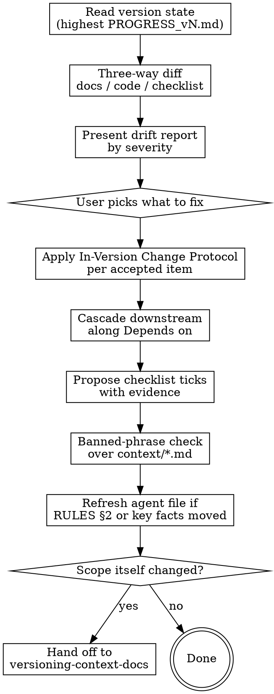

# Aligning Context Docs

## Overview

Docs drift. Not because anyone is careless — because a change lands in code in
one minute and in a doc in ten, and the ten never happen. After a few weeks the
`context/` folder describes a system that no longer exists, and at that point it
is worse than absent: it actively misleads, and every agent that reads it inherits
the lie.

This skill pulls the set back into alignment **without moving the project
version**, and it enforces the one rule that keeps the docs readable while it
does: **the doc says what is true, the changelog says why it changed.**

**Core principle:** you are reconciling three sources that disagree — what the
docs claim, what the code does, and what the version's checklist says is in
scope. The disagreements are the deliverable. Fixing them is the user's call,
one at a time.

## When to Use

- The code and the docs disagree, or the user says the docs are stale
- A decision is being reversed or refined and the version is not moving
- A feature or dependency landed that no doc mentions
- Checklist items in `PROGRESS_v<N>.md` are done but unticked, or ticked but not actually met
- Before closing a version — `versioning-context-docs` calls this first, because closing on drifted docs bakes the drift in permanently

**Do NOT use for:** creating a doc set that does not exist (`bootstrapping-context-docs`); closing a version and opening the next (`versioning-context-docs`); a typo or formatting pass, which is not a revision and needs none of this.

## Before You Start

1. **`references/hosts.md`** — which host, whether you have subagents, and whether the agent file supports `@file` imports. The last one matters here: if RULES §2 changes, you refresh it in the agent file, and the two forms are different.
2. **`references/history-discipline.md`** — the In-Version Change Protocol. It is the procedure this whole skill executes.
3. **`references/doc-contract.md`** — the header, and how to migrate a legacy one.

## Flow



## Step 1 — Establish the version state

Never guess which version is current.

```
context/PROGRESS/PROGRESS_v*.md  -> the highest N whose Status is "open" is the current version
                                    if the highest is "closed", say so: the user is between
                                    versions, and opening the next is versioning-context-docs
none present                     -> the set predates PROGRESS/. Say so, offer to derive
                                    PROGRESS_v1.md from the docs as they stand, and gate it.
```

Read `PROGRESS_v<N>.md` (scope, checklist, open questions) and `CHANGELOG_v<N>.md`
(what has already changed this version — do not re-report a change that is
already logged). Then read every `context/*.md` header and note each doc's
`Revision`.

State in one line where things stand before you diff anything:

> Current version is v1, open since 2026-03-14. Four docs, revisions 3/2/1/1.
> Eleven checklist items, four ticked. Six changelog entries so far.

## Step 2 — The three-way diff

This is the work. For each doc in the set, hold three things against each other:

| Source | Is | Weighs |
|---|---|---|
| the doc | what was decided | intent |
| the code | what exists | evidence |
| `PROGRESS_v<N>.md` | what this version committed to | scope |

**Where a doc and the code disagree, the code is evidence and the doc is intent.**
That does not automatically mean the doc is wrong — sometimes the code drifted
from a decision that still stands, and the fix is in the code. Report the gap; do
not assume which side loses.

`references/drift-scan.md` has the per-doc scan: what to read, and what a
mismatch looks like for each of PRODUCT, ARCHITECTURE, SCHEMA, DESIGN and RULES.

## Step 3 — The drift report

Group by severity, most severe first. Every finding names its evidence — a file
and line, a manifest entry, a migration — because a finding the user cannot
verify is a finding they cannot act on.

**CRITICAL** — the doc asserts something the code contradicts.
> `ARCHITECTURE.md` §6 says the store is SQLite via Drizzle.
> `package.json` has `pg` and `drizzle-orm/node-postgres`, and
> `docker-compose.yml` runs Postgres 16. Evidence says Postgres.

**MAJOR** — the code contains a library, service or entity no doc mentions. This
is a `RULES.md` §2 rule 2 violation: an architectural decision made inline and
never written down.
> `apps/api/src/cache.ts` imports `ioredis`, and compose runs Redis.
> `ARCHITECTURE.md` names no cache layer at all.

**MINOR** — stale wording, a checklist item satisfied but unticked, numbering.
> `PROGRESS_v1.md` item "Habit CRUD" is unticked, but all three of its
> acceptance criteria are covered by `src/db/habits.ts` and
> `test/habits.test.ts`.

Cap the report at what a person can act on in one sitting. If there are forty
findings, report the CRITICALs and MAJORs in full, count the MINORs, and offer the
list.

## Step 4 — The user picks

**Never auto-edit an approved doc.** These docs were earned by interrogation; a
silent rewrite destroys the property that makes them trustworthy.

Present the findings and let the user choose. For each, offer the two directions
explicitly, because which one is right is not yours to decide:

> The Redis cache: do I write it into `ARCHITECTURE.md` as a decision that stands,
> or is it something that went in by accident and should come out of the code?

For anything consequential, the same pros/cons discipline as bootstrap applies:
name the cost of the direction the user picks, once, before recording it.

## Step 5 — Apply the In-Version Change Protocol

For each accepted fix, in full, per `references/history-discipline.md`:

1. **Rewrite the doc into the new decision.** Delete the old text — do not annotate, contrast, or explain it. The doc reads as if it had always said this.
2. **Bump `Revision` and `Last updated`.** `Project version` does not move.
3. **Append to `CHANGELOG_v<N>.md`** — changed, why, affects.
4. **Cascade** along `Depends on` before you finish.
5. **Re-check `PROGRESS_v<N>.md`** if scope, criteria or open questions moved.
6. **Run the banned-phrase check.**

### The cascade is the part that gets skipped

This is the "hard to align the files" problem, and it has one cause: a change is
applied to the doc it was raised against, and the docs downstream of it are left
disagreeing.

Walk the chain **downhill** from every doc you touched:

```
PRODUCT -> ARCHITECTURE -> SCHEMA -> DESIGN -> RULES
                       \-> DESIGN
```

For each downstream doc, ask the specific question, not a general one:

| Changed | Then check |
|---|---|
| `PRODUCT.md` feature or field | does `SCHEMA.md` still have a home for every field? does `DESIGN.md` still have a screen? |
| `ARCHITECTURE.md` store, ORM or migration tool | does `SCHEMA.md` assume the old one? does `RULES.md` §9 name the old migration command? |
| `ARCHITECTURE.md` repo layout | does `RULES.md` §3 describe the old layout? is the tree in §3 still the tree on disk? |
| `SCHEMA.md` entity or column | does `PRODUCT.md` describe a field that no longer exists? does `DESIGN.md` show it? |
| `DESIGN.md` screen or flow | is every screen still reachable? does `PRODUCT.md` still claim the feature? |
| `RULES.md` §2 | **the agent file needs refreshing** — see step 7 |

Each cascaded doc gets its own `Revision` bump. **One changelog entry covers the
whole cascade**, listing every doc it touched under **Affects** — that is what
makes the blast radius findable later.

A change is not complete while a downstream doc contradicts it. Do not report
back until the walk is done.

## Step 6 — Checklist ticks, with evidence

Every tick is **proposed, never silent**, and every tick names what satisfies it:

> `PROGRESS_v1.md` item "Daily check-in":
>   AC "tapping a habit records an entry dated today" — `src/db/entries.ts:34`, `test/entries.test.ts:12`
>   AC "tapping again removes it, no duplicate can exist" — unique index in `src/db/schema.ts:41`, `test/entries.test.ts:28`
>   Both met. Tick it?

An acceptance criterion with no evidence is not met, however finished the feature
looks. If a criterion cannot be evidenced, say which one and why — that is
usually the most useful finding in the whole pass, because it is the gap between
"we built it" and "we can show it works".

Update `Last updated` in `PROGRESS_v<N>.md` when you tick anything.

## Step 7 — Refresh the agent file

Only when something in it moved:

- **`RULES.md` §2 changed** — on a host with `@file` import support, the import picks it up and there is nothing to do. Without one, replace the text **between** the `<!-- context-docs-kit:rules:start -->` and `<!-- context-docs-kit:rules:end -->` markers. Never append a second copy. If the markers are missing on an import-less host, the rules were never wired — add the block and say so.
- **A Quick-Reference key fact changed** — stack, layout, hosting, the binding constraint, the current version. Update those bullets and nothing else.
- **The doc set changed** — a doc added or dropped. Update the Context Docs Map table.

`references/agent-file.md` has the exact blocks and the refresh rules. Merge, never overwrite; preserve every other section verbatim.

## Step 8 — Say what you did, and what you did not

Close with a plain account:

> Fixed: `ARCHITECTURE.md` rev 4 (Postgres), `SCHEMA.md` rev 3 (cascade: the
> local/server lockstep note no longer applies), `RULES.md` rev 2 (§9 migration
> command). One `CHANGELOG_v1.md` entry covering all three. Ticked "Habit CRUD".
> Refreshed the Quick-Reference backend bullet in `AGENTS.md`.
>
> Left open: the Redis cache. You wanted to decide whether it stays before it
> goes in the doc, so `ARCHITECTURE.md` still doesn't mention it — it's the one
> known gap between the docs and the code right now.

Naming what is still misaligned matters more than the list of fixes. A pass that
reports only successes leaves the user believing the set is clean when it is not.

## When the scope itself changed

Sometimes the drift is not a wrong doc — the version is being asked to do
something it never committed to. Symptoms: a feature in the code that no
checklist item covers and that the user wants to keep; a checklist item that
nobody intends to build; acceptance criteria that no longer describe the goal.

Say so plainly and hand off:

> Three of these aren't drift — they're new scope. The auth work isn't in v1's
> checklist at all. Adding it here would quietly redefine what v1 means, and then
> nothing decides when v1 ends. Either it goes in explicitly as a v1 item, and I
> add it with acceptance criteria, or v1 closes and this opens v2 — that's
> `versioning-context-docs`.

Adding a checklist item to the current version is fine when the user decides it
explicitly. Doing it quietly, item by item, is how a version stops ever ending.

## Red Flags — STOP

| Rationalization | Reality |
|---|---|
| "The code is right, I'll just update the doc" | Report the gap and let the user pick the direction. Sometimes the code is the thing that drifted. |
| "I'll note in the doc that this replaced the earlier approach" | Never. Present tense in the doc, reason in `CHANGELOG_v<N>.md`. That is the entire point of this skill. |
| "Just this one 'previously' makes it clearer" | It is a defect at the same severity as an invented fact. Run the banned-phrase check. |
| "I fixed the doc the finding was about" | Then you are half done. Cascade downhill along `Depends on` before reporting back. |
| "It's obviously done, I'll tick it" | Every tick needs evidence, and every tick is proposed to the user first. |
| "These docs are a mess, I'll rewrite the set" | This is not a re-bootstrap. Fix what drifted; leave earned decisions alone. |
| "I'll add the missing feature to the checklist while I'm here" | That is scope, not drift. The user decides, explicitly. |
| "I changed RULES §2, the agent file will pick it up" | Only on hosts with import support. Everywhere else you refresh the marker block by hand. |
| "The version looks finished, I'll close it" | Only the user closes a version, and only through `versioning-context-docs`. |
| "One entry per doc I touched is tidier" | One entry per *change*, listing every affected doc. Split entries hide the blast radius. |

## Reference Index

| File | When |
|---|---|
| `references/hosts.md` | first |
| `references/doc-contract.md` | before editing any doc header |
| `references/history-discipline.md` | the protocol itself — the core of this skill |
| `references/drift-scan.md` | step 2, the per-doc three-way diff |
| `references/agent-file.md` | step 7, if the agent file needs refreshing |
| `references/critic.md` | after a substantial rewrite, to check the result like a fresh draft |
