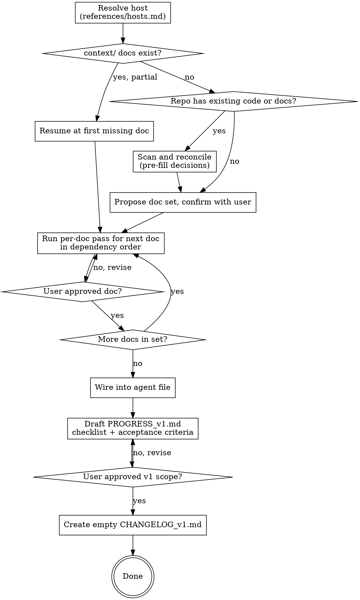

# Bootstrapping Context Docs

## Overview

A context doc records **decisions that have been earned by interrogation** — not fields filled into a template. The folder is the contract every later change is checked against, so a doc containing a guess is worse than a doc containing an admitted unknown.

**Core principle:** you are not producing documents. You are extracting decisions the user already half-holds, pricing the ones they haven't costed, and parking the ones they genuinely haven't made.

A generated template and a grilled doc look similar and behave nothing alike. The template's gaps are invisible; the grilled doc's gaps are written down in `## Open Questions`.

## When to Use

- A project has no `context/`, `docs/`, or foundation docs and code is about to be written
- The user asks for a PRD, product doc, architecture doc, schema, design doc, or coding conventions
- A `context/` folder exists but is empty or partial (resume it — see `references/wiring.md`)
- Scattered docs exist under other names and need consolidating into one chain
- Nobody has written down the stack, the constraints, or why they were chosen

**Do NOT use for:** docs that exist but no longer match the code — that is `aligning-context-docs`; closing a version and opening the next — that is `versioning-context-docs`; adding one section to an already-complete doc set (just edit it); project-specific conventions that belong in the repo's agent file rather than a doc; or a throwaway script.

## Before the First Question

Two files, in this order:

1. **`references/hosts.md`** — which host you are on, whether you have persona subagents, and whether the agent file supports `@file` imports. Two of the three answers change what you write into the user's repo, so resolve them now, not at the wiring step.
2. **`references/wiring.md`** — where you enter: greenfield, brownfield, or resume.

## The Doc Contract

Every doc in the set carries the same header and closing sections. The full contract is in **`references/doc-contract.md`** — read it before drafting anything.

```markdown
# <Project> — <Doc Title>

**Project version:** v1
**Revision:** 1
**Last updated:** YYYY-MM-DD          <- the real current date, never invented
**Depends on:** [PRODUCT.md](./PRODUCT.md), [ARCHITECTURE.md](./ARCHITECTURE.md)
```

Two things it is worth carrying in your head for the whole pass:

- **`v` means the project version, never a doc's revision.** A doc's revision is a bare integer. `v1` is the product; `Revision: 3` is the file.
- **Present tense only.** A doc says what is decided now, never how it got there. Reasons live in `context/PROGRESS/CHANGELOG_v1.md`. See `references/history-discipline.md`.

## Flow



## The Doc Set

Confirm the set with the user before writing anything. Default is adaptive, not fixed:

| Doc | Include when | Persona |
|---|---|---|
| `PRODUCT.md` | always | `product-strategist` |
| `ARCHITECTURE.md` | always | `solutions-architect` |
| `SCHEMA.md` | the project has persistent data | `data-modeler` |
| `DESIGN.md` | the project has a user interface | `product-designer` |
| `RULES.md` | always | `engineering-standards` |

Additional docs when the project warrants them — see `references/optional-docs.md`. A CLI tool with no persistence gets three docs, not five with two stubs. Say which you are dropping and why, then let the user correct you.

The pass ends with two more files that are not docs and are not optional: `context/PROGRESS/PROGRESS_v1.md` and `context/PROGRESS/CHANGELOG_v1.md`.

## The Per-Doc Pass

Five stages. **Only stages 2 and 5 involve the user.**

| # | Stage | Who | Interactive |
|---|---|---|---|
| 1 | Scan | the doc's persona | no |
| 2 | **Grill** | you, in the main conversation, wearing the persona | **yes** |
| 3 | Draft | the doc's persona | no |
| 4 | Review | the critic | no |
| 5 | **Gate** | the user | **yes** |

**Subagents cannot talk to the user.** They run in isolation with no channel to ask anything. The interview therefore happens in the main conversation — you adopt the persona from `references/<doc>.md` and grill directly. Never dispatch an agent to "interview the user."

On a host without subagents, stages 1, 3 and 4 run inline instead of being dispatched. The sequence does not change. `references/hosts.md` says exactly how, and why stage 4 must be its own turn.

Stage 1 reads manifests, layout, migrations, CI, and pre-existing docs, and returns facts to pre-fill your questions. Skip it on a truly empty repo.

Stage 3 writes the doc from **approved answers only**, with unknowns parked.

Stage 4 is adversarial and independent — `references/critic.md`. A persona reviewing its own draft carries the blind spots that produced it. Fix what the critic finds, or park it, before the gate.

Stage 5 is a hard stop. Do not begin the next doc until the user approves this one.

### Two passes have an extra gate

- **`ARCHITECTURE.md`** — the **Architecture Presentation Gate** sits between stages 2 and 3. You present the stack, the repo tree and the system diagram, and the user approves the picture before a word of the doc is written. `references/architecture.md`.
- **`RULES.md`** — design principles are settled by the **worked-example loop**, not by a question. Every principle arrives with a concrete scenario from this codebase and is agreed on the example, not the abstraction. `references/rules.md`.

## Grilling Rules

1. **One question at a time.** Never bundle. A question whose answer changes later questions must be answered first.
2. **Always include a recommendation** with your reasoning. "What database do you want?" is lazy; "Postgres — you already run it in compose, and the relational shape here is obvious. Object here if you expect document-shaped data." is a question.
3. **Explore the codebase instead of asking anything the code answers.** Reading `package.json` is faster than asking, and asking a question the repo already answers erodes trust in every other question.
4. **Dependencies before dependents.** Resolve the decision that constrains others first. Do not ask about caching strategy before the storage model exists.
5. **Elicit the hardest constraint early**, and give it its own top-level section in `ARCHITECTURE.md`. A binding constraint ("no Mac available", "must run air-gapped", "one engineer, part-time") reshapes every downstream choice and belongs in writing, not in your head.
6. **Show, don't state, when a decision has a shape.** A principle, a repo layout, a data flow, a screen — render it and let the user react to the artifact. People correct a concrete thing accurately and nod at an abstract one vaguely.

If the user has a `grill-me` skill available, its interviewing style applies here too.

## Pros/Cons Discipline

For every **consequential** decision — anything a future change would be expensive to reverse — do all three:

1. **Name the realistic options with their actual cost.** Two or three, not an encyclopedia. Costs must be real, not symmetrical filler.
2. **Recommend one, with the reason tied to this project's constraints**, not to general popularity.
3. **Never let a choice be recorded blind.** If the user picks an option without acknowledging its main downside, state that downside once and ask them to confirm. Then record it as settled and move on.

```
> "Let's use SQLite."

  Confirming the cost: SQLite means you own
  conflict resolution when sync arrives, since
  there's no server-side merge. Accept, or want
  to look at the alternative?
```

**Calibrate depth to demonstrated fluency, not to a self-assessment.** When answers show the user already knows a domain, compress to one-line tradeoffs. When answers are hesitant or generic, expand. Never skip step 3 regardless of fluency — it costs one sentence and prevents silent regret.

**Never introduce a library, service, or architectural approach the user has not explicitly confirmed.** Recording an unconfirmed vendor choice as settled is the single most damaging thing this skill can do, because every later doc inherits it.

## Open Questions Discipline

**Park, don't guess.** When the user doesn't know, hasn't decided, or says "figure it out later", that goes in `## Open Questions` with enough context to resume it — not into the body as a plausible-looking value.

A parked unknown is a success. An invented specific is the primary failure mode of this skill: it reads as decided, nobody revisits it, and three docs downstream depend on it.

Good: *"Paid storage tier sizes and price point — to be decided once the core product is validated with real usage."*
Bad: a `$4.99/mo` that nobody ever chose.

An open question that would block v1 also goes into `PROGRESS_v1.md` §4, so it is visible from the scope file rather than only from the doc that parked it.

## Closing the Pass

Not done when the last doc is approved. Three steps remain, in order:

1. **Wire the agent file** — `references/wiring.md` §3, using the import or the inline block per `references/hosts.md`. An unwired `context/` is inert.
2. **Draft `context/PROGRESS/PROGRESS_v1.md`** — read every approved doc and derive the v1 scope checklist with acceptance criteria. Gate it with the user like any other doc. Always `v1`; there is no path that starts anywhere else. Full spec in `references/history-discipline.md`.
3. **Create `context/PROGRESS/CHANGELOG_v1.md`** — empty but for its title. A first draft is not a revision of anything, so there is nothing to log yet.

Then tell the user what happens next: changes inside v1 go through `aligning-context-docs`, and v1 closes only when they say so, through `versioning-context-docs`.

## Red Flags — STOP

| Rationalization | Reality |
|---|---|
| "I'll draft the docs and let them edit" | Editing a template is not deciding. Grill first. |
| "This project is simple, skip the doc-set confirmation" | Simple projects are where unexamined assumptions cost most. |
| "I'll write SCHEMA now and reconcile with PRODUCT later" | Dependents after dependencies. Always. |
| "I don't know their price point, I'll put something reasonable" | Park it. Inventing decisions is the main failure. |
| "They clearly know this, tradeoffs would be condescending" | One sentence naming the cost. Always. |
| "I'll ask these five things together to save time" | One question at a time. |
| "The stack is obvious for this kind of project" | Never record an unconfirmed library or service. |
| "I'll dispatch an agent to interview them" | Subagents cannot talk to the user. |
| "No subagents here, so I'll skip the review stage" | Run it inline, in its own turn. The review is the stage, not the agent. |
| "There's an existing prd.md, I'll just rename it" | Reconcile and interrogate it. Inherited docs carry unexamined assumptions. |
| "Five docs is the standard, write all five" | Adaptive set. A stub doc teaches nothing. |
| "The docs are written, we're done" | Not done until the agent file is wired and `PROGRESS_v1.md` is approved. |
| "I'll describe the architecture in the doc, that's clearer than a diagram" | Present the tree and the diagram first. The user corrects a picture; they nod at a paragraph. |
| "They agreed to the principle, the example is busywork" | The example is what they agreed to. A principle with no accepted example does not enter `RULES.md`. |
| "This project already shipped, so start at v2" | The first `PROGRESS` file is always `v1`. What shipped before was never tracked here. |
| "The checklist is obvious, acceptance criteria are overkill" | Without them nobody can say whether v1 is done, so v1 never ends. |
| "v1 looks complete, I'll mark it done" | Only the user closes a version. |
| "I'll note in the doc that this replaced the earlier approach" | History is never inline. It goes in `CHANGELOG_v1.md`; the doc stays present tense. |
| "This `@context/RULES.md` line works everywhere" | Only on hosts with import support. Check `references/hosts.md` or the rules silently never apply. |

## Reference Index

Load only what the current pass needs.

| File | When |
|---|---|
| `references/hosts.md` | first, before anything else |
| `references/wiring.md` | second, and again at the end |
| `references/doc-contract.md` | before drafting any doc |
| `references/product.md` | PRODUCT.md pass |
| `references/architecture.md` | ARCHITECTURE.md pass |
| `references/schema.md` | SCHEMA.md pass |
| `references/design.md` | DESIGN.md pass |
| `references/rules.md` | RULES.md pass |
| `references/critic.md` | stage 4 of every pass |
| `references/optional-docs.md` | doc-set proposal, if the core five don't fit |
| `references/history-discipline.md` | closing the pass, and any revision to a doc already approved |
