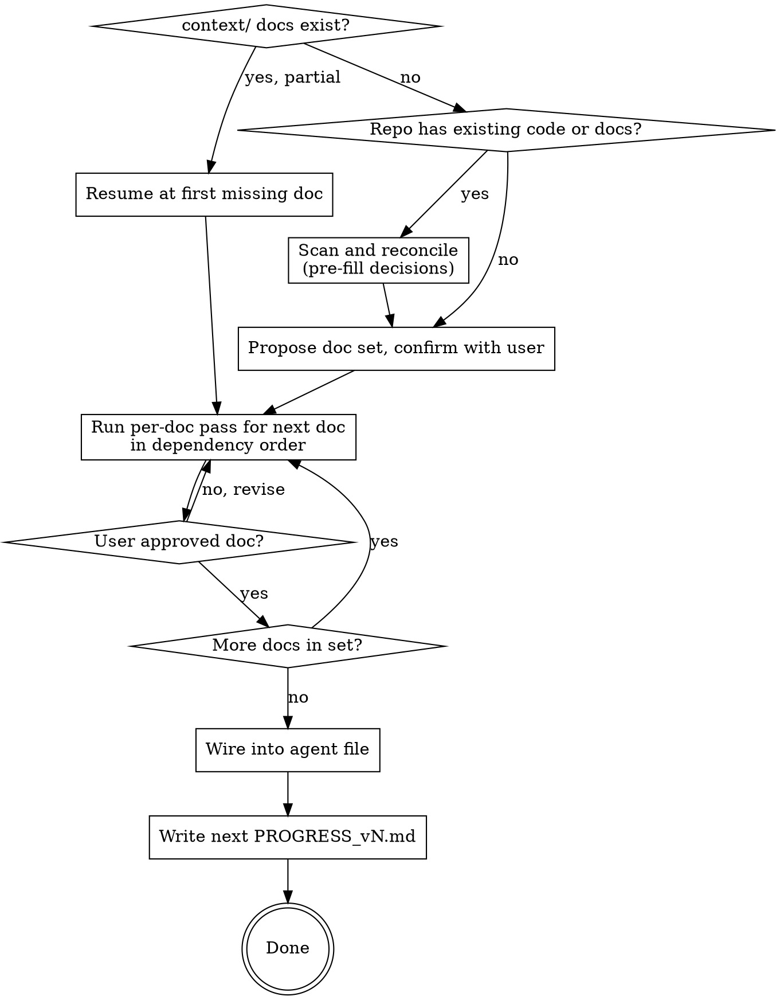

# Bootstrapping Context Docs

## Overview

A context doc records **decisions that have been earned by interrogation** — not fields filled into a template. The folder is the contract every later change is checked against, so a doc containing a guess is worse than a doc containing an admitted unknown.

**Core principle:** you are not producing documents. You are extracting decisions the user already half-holds, pricing the ones they haven't costed, and parking the ones they genuinely haven't made.

A generated template and a grilled doc look similar and behave nothing alike. The template's gaps are invisible; the grilled doc's gaps are written down in `## Open Questions`.

## When to Use

- A project has no `context/`, `docs/`, or foundation docs and code is about to be written
- The user asks for a PRD, product doc, architecture doc, schema, design doc, or coding conventions
- A `context/` folder exists but is empty or partial (resume it — see `references/wiring.md`)
- Scattered docs exist under other names and need consolidating into one chain
- Nobody has written down the stack, the constraints, or why they were chosen

**Do NOT use for:** adding one section to an already-complete doc set (just edit it); project-specific conventions that belong in the repo's agent file rather than a doc; or a throwaway script.

## The Doc Contract

Every doc in the set — no exceptions:

```markdown
# <Project> — <Doc Title>

**Status:** Draft v1
**Last updated:** YYYY-MM-DD          <- the real current date, never invented
**Depends on:** [PRODUCT.md](./PRODUCT.md), [ARCHITECTURE.md](./ARCHITECTURE.md)

## 1. Overview
...
## N. Out of Scope for v1
## N+1. Open Questions
## N+2. Next Steps
```

- **`Depends on:`** encodes the chain. Decisions flow downhill and docs are written in that order. `PRODUCT` depends on nothing.
- **`Open Questions`** is the escape hatch that makes honest docs possible. Never omit it, even when empty (say "none currently open").
- **`Next Steps`** names the next doc to write, so the set is resumable by a future session with no memory of this one.
- **`Status: Draft vN`** — bump N on every substantive revision, and log it in `context/CHANGE_LOG.md` (see below). Version skew between docs is normal and informative.

**Present tense only.** A doc describes what's decided *now* — never how it got there. No "previously", "used to be", "as of v2 we switched". If a decision changes, the doc reads after the edit as if that had always been the decision. Revision history goes in `context/CHANGE_LOG.md`, and scope snapshots go in `context/PROGRESS/PROGRESS_vN.md` — never inline in the doc itself. See `references/changelog-and-progress.md`.

## Flow

Load `references/wiring.md` first — it decides where you enter.



## The Doc Set

Confirm the set with the user before writing anything. Default is adaptive, not fixed:

| Doc | Include when | Persona agent |
|---|---|---|
| `PRODUCT.md` | always | `product-strategist` |
| `ARCHITECTURE.md` | always | `solutions-architect` |
| `SCHEMA.md` | the project has persistent data | `data-modeler` |
| `DESIGN.md` | the project has a user interface | `product-designer` |
| `RULES.md` | always | `engineering-standards` |

Additional docs when the project warrants them — see `references/optional-docs.md`. A CLI tool with no persistence gets three docs, not five with two stubs. Say which you are dropping and why, then let the user correct you.

## The Per-Doc Pass

Five stages. **Only stages 2 and 5 involve the user.**

| # | Stage | Who | Interactive |
|---|---|---|---|
| 1 | Scan | the doc's persona agent | no |
| 2 | **Grill** | you, in the main conversation, wearing the persona | **yes** |
| 3 | Draft | the doc's persona agent | no |
| 4 | Review | `context-doc-critic` | no |
| 5 | **Gate** | the user | **yes** |

**Subagents cannot talk to the user.** They run in isolation with no channel to ask anything. The interview therefore happens in the main conversation — you adopt the persona from `references/<doc>.md` and grill directly. Never dispatch an agent to "interview the user."

Stage 1 dispatches the persona agent to read manifests, layout, migrations, CI, and pre-existing docs, and return facts to pre-fill your questions. Skip it on a truly empty repo.

Stage 3 dispatches the persona agent to write the doc from **approved answers only**, with unknowns parked. It writes the file directly rather than returning a draft through context.

Stage 4 dispatches `context-doc-critic` — deliberately a *different* agent. A persona reviewing its own draft carries the blind spots that produced it. Fix what the critic finds, or park it, before the gate.

Stage 5 is a hard stop. Do not begin the next doc until the user approves this one.

## Grilling Rules

1. **One question at a time.** Never bundle. A question whose answer changes later questions must be answered first.
2. **Always include a recommendation** with your reasoning. "What database do you want?" is lazy; "Postgres — you already run it in compose, and the relational shape here is obvious. Object here if you expect document-shaped data." is a question.
3. **Explore the codebase instead of asking anything the code answers.** Reading `package.json` is faster than asking, and asking a question the repo already answers erodes trust in every other question.
4. **Dependencies before dependents.** Resolve the decision that constrains others first. Do not ask about caching strategy before the storage model exists.
5. **Elicit the hardest constraint early**, and give it its own top-level section in `ARCHITECTURE.md`. A binding constraint ("no Mac available", "must run air-gapped", "one engineer, part-time") reshapes every downstream choice and belongs in writing, not in your head.

If the user has a `grill-me` skill available, its interviewing style applies here too.

## Pros/Cons Discipline

For every **consequential** decision — anything a future change would be expensive to reverse — do all three:

1. **Name the realistic options with their actual cost.** Two or three, not an encyclopedia. Costs must be real, not symmetrical filler.
2. **Recommend one, with the reason tied to this project's constraints**, not to general popularity.
3. **Never let a choice be recorded blind.** If the user picks an option without acknowledging its main downside, state that downside once and ask them to confirm. Then record it as settled and move on.

```
> "Let's use SQLite."

  Confirming the cost: SQLite means you own
  conflict resolution when sync arrives, since
  there's no server-side merge. Accept, or want
  to look at the alternative?
```

**Calibrate depth to demonstrated fluency, not to a self-assessment.** When answers show the user already knows a domain, compress to one-line tradeoffs. When answers are hesitant or generic, expand. Never skip step 3 regardless of fluency — it costs one sentence and prevents silent regret.

**Never introduce a library, service, or architectural approach the user has not explicitly confirmed.** Recording an unconfirmed vendor choice as settled is the single most damaging thing this skill can do, because every later doc inherits it.

## Open Questions Discipline

**Park, don't guess.** When the user doesn't know, hasn't decided, or says "figure it out later", that goes in `## Open Questions` with enough context to resume it — not into the body as a plausible-looking value.

A parked unknown is a success. An invented specific is the primary failure mode of this skill: it reads as decided, nobody revisits it, and three docs downstream depend on it.

Good: *"Paid storage tier sizes and price point — to be decided once the core product is validated with real usage."*
Bad: a `$4.99/mo` that nobody ever chose.

## Red Flags — STOP

| Rationalization | Reality |
|---|---|
| "I'll draft the docs and let them edit" | Editing a template is not deciding. Grill first. |
| "This project is simple, skip the doc-set confirmation" | Simple projects are where unexamined assumptions cost most. |
| "I'll write SCHEMA now and reconcile with PRODUCT later" | Dependents after dependencies. Always. |
| "I don't know their price point, I'll put something reasonable" | Park it. Inventing decisions is the main failure. |
| "They clearly know this, tradeoffs would be condescending" | One sentence naming the cost. Always. |
| "I'll ask these five things together to save time" | One question at a time. |
| "The stack is obvious for this kind of project" | Never record an unconfirmed library or service. |
| "I'll dispatch an agent to interview them" | Subagents cannot talk to the user. |
| "There's an existing prd.md, I'll just rename it" | Reconcile and interrogate it. Inherited docs carry unexamined assumptions. |
| "Five docs is the standard, write all five" | Adaptive set. A stub doc teaches nothing. |
| "The docs are written, we're done" | Not done until the agent file is wired. An unwired `context/` is never read. |
| "I'll note in the doc that we used to do X" | History is never inline. Log it in `context/CHANGE_LOG.md`; the doc itself stays present tense. |

## Reference Index

Load only what the current pass needs.

| File | When |
|---|---|
| `references/wiring.md` | first, and again at the end |
| `references/product.md` | PRODUCT.md pass |
| `references/architecture.md` | ARCHITECTURE.md pass |
| `references/schema.md` | SCHEMA.md pass |
| `references/design.md` | DESIGN.md pass |
| `references/rules.md` | RULES.md pass |
| `references/optional-docs.md` | doc-set proposal, if the core five don't fit |
| `references/changelog-and-progress.md` | any substantive revision to an existing doc, and at the end of a full bootstrap pass |
