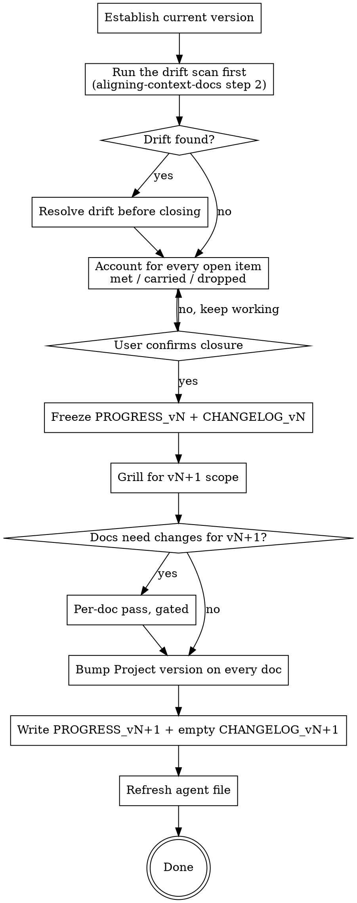

# Versioning Context Docs

## Overview

A version ends when the user says it ends. Not when the checklist looks full, not
when the code seems finished, and never on your judgment.

That rule exists because the alternative destroys the thing versions are for. If
a version can end quietly, or absorb one more item, or carry an unmet criterion
forward without anyone noticing, then "v1" stops meaning anything specific and
the checklist stops being a commitment. A version is only useful while it is
closeable and closed deliberately.

**Core principle:** closing a version is an accounting exercise before it is a
planning one. Every open item is either **met with evidence**, **explicitly
carried forward**, or **explicitly dropped**. There is no fourth option, and
nothing moves silently.

## When to Use

- The user says the current version is done, or asks to close it
- The user asks to start the next version, or to plan v2
- The user asks whether the current version is finished
- Every checklist item is ticked and the user wants to know what happens now

**Do NOT use for:** creating a doc set (`bootstrapping-context-docs`); fixing drift or a changed decision inside the current version (`aligning-context-docs`); adding one item to the current version's checklist, which is `aligning-context-docs` with the user's explicit say-so.

## Before You Start

1. **`references/hosts.md`** — host, subagents, whether the agent file supports `@file` imports.
2. **`references/history-discipline.md`** — the shape of `PROGRESS_vN.md` and `CHANGELOG_vN.md`, and the In-Version Change Protocol you will still be applying for any doc that changes.
3. **`references/doc-contract.md`** — the header, and which field moves here. **`Project version` moves only in this skill.** Nothing else in the kit is allowed to touch it.

## Flow



## Step 1 — Establish where you are

```
highest context/PROGRESS/PROGRESS_v*.md
  Status: open      -> that is the current version. Proceed.
  Status: closed    -> the previous version is already closed and the next was
                       never opened. Skip to step 5 and open it.
  none present      -> there is no version tracking yet. This is bootstrap's job:
                       say so, and offer bootstrapping-context-docs.
```

Read the checklist, the §4 provisional decisions, `CHANGELOG_v<N>.md`, and every doc's
header. State the position in one line before doing anything:

> v1 has been open since 2026-03-14. Eleven checklist items, eight ticked,
> three not. Two provisional decisions still in force. Nine changelog entries.

## Step 2 — Scan for drift before closing anything

**Closing a version on drifted docs bakes the drift in permanently.** Once
`PROGRESS_v1.md` is frozen, its doc-set table is a claim about history, and a
wrong claim there is never revisited.

Run the three-way diff from `references/drift-scan.md` — the same scan
`aligning-context-docs` runs. If it finds anything above MINOR, stop and resolve
it first, applying the In-Version Change Protocol. That work still belongs to
vN: the docs are being corrected to describe what vN actually is, not changed to
describe vN+1.

If the drift turns out to be large, say so and offer to run the alignment pass
properly before returning here. A rushed reconciliation inside a closure is how
a wrong doc-set table gets frozen.

## Step 3 — Account for every open item

This is the heart of the skill. Go through the checklist item by item. Each one
lands in exactly one of three buckets, and the user decides which:

**Met** — every acceptance criterion has evidence. Name the evidence, tick it.

> "Streak display" — AC 1 satisfied by `src/core/streak.ts:22` and
> `test/streak.test.ts`; AC 2 (resets on a missed day) satisfied by
> `test/streak.test.ts:41`. Tick?

**Carried forward** — not done, still wanted. It moves to vN+1's checklist, with
its acceptance criteria intact, marked as carried.

**Dropped** — not done, no longer wanted. It leaves the checklist and is recorded
in the closing summary as dropped, with the reason. A dropped item is not a
failure; an *undocumented* dropped item is, because it looks like an oversight
forever after.

Do the same for every **§4 provisional decision**, in the same three buckets:

**Settled** — the information arrived. If the answer differs from the decision in
force, that is a doc change: apply the In-Version Change Protocol before closing,
because it belongs to vN. Then delete the entry.

**Carried forward** — still unsettled. The decision in force stays in force, and
the entry moves to vN+1's §4 unchanged.

**No longer relevant** — whatever it concerned has left the product. Delete the
entry and note it in the closing summary.

### Never carry anything silently

The failure mode this prevents: an item quietly reappears in vN+1 with no record
that it was promised in vN. Do that twice and nobody trusts a checklist again.

Say the accounting out loud before asking for confirmation:

> Of eleven items: eight met with evidence, two carried to v2 (offline sync,
> export), one dropped (weekly email digest — you said notifications are out of
> scope entirely now). Of two provisional decisions: pricing settled (v1 stays
> free, now permanently), target-frequency shape carried to v2 still provisional.
>
> That accounts for everything. Close v1?

## Step 4 — Freeze vN

Only after the user confirms, in these words or clearly equivalent: yes, close it.

**`PROGRESS_v<N>.md`:**

- `**Status:**` becomes `closed YYYY-MM-DD`
- `**Last updated:**` gets the real current date
- Append a `## Closing summary` — what shipped, what was carried and where to, what was dropped and why

```markdown
## Closing summary

Closed 2026-06-01. Eight of eleven items met.

**Carried to v2:** offline sync, CSV export — criteria unchanged.
**Dropped:** weekly email digest. Notifications left the product's scope
entirely once the local-first design was confirmed; PRODUCT.md §9 records it
as out of scope.
```

**`CHANGELOG_v<N>.md`:** append one final line noting the version closed and
its date. **Never write to this file again.** Everything after this point belongs
to vN+1's changelog.

The frozen files are never edited afterwards. If something in a closed version
turns out to be wrong, it is corrected in the current version's docs and logged
in the current version's changelog — not retro-edited into history.

## Step 5 — Grill for the next version's scope

Same discipline as bootstrap: one question at a time, a recommendation with each,
real costs on consequential decisions, and park what is undecided rather than
inventing it. `references/next-version.md` has the question bank.

Start from what the closure produced — the carried items are already scope, and
they anchor the conversation:

> Two items carry over: offline sync and export. Sync is the one with real
> architectural weight, so before we add anything new: is v2 mainly about making
> sync real, or is sync one item among several?

Then the shape of the version, then the new work. Do not let v2 become "everything
we didn't do", which is how a version becomes uncloseable before it starts.

## Step 6 — Update the docs for the new version

Most doc changes are just the header. Some are real.

**Every doc gets `**Project version:**` bumped to vN+1.** This is a version
rollover, not a revision: `Revision` does not move, and it is not logged in the
changelog — nothing about the content changed.

**A doc whose content changes for the new version goes through a full pass** —
grill, draft, review, gate — exactly as in bootstrap. Read the matching
`references/<doc>.md` from the bootstrap skill if it is installed, or run the
pass from the same principles. Content changes here are logged in
`CHANGELOG_v<N+1>.md` like any other change, because they belong to the new
version.

Two docs are worth checking specifically:

- **`ARCHITECTURE.md`** — does the new scope invalidate §2's binding constraint, or add a component the diagram does not show? A new version is the natural moment to re-ask whether the constraint still binds.
- **`RULES.md`** — do §4's worked examples still describe real seams after the new scope lands?

## Step 7 — Open vN+1

**`context/PROGRESS/PROGRESS_v<N+1>.md`** — same structure as v1, per
`references/history-discipline.md`, with two additions:

- **Carried items come first**, marked, with their original criteria and where they came from:
  ```markdown
  - [ ] **Offline sync** *(carried from v1)*
    - AC: an entry created offline appears on a second device within 30s of reconnect
    - AC: two devices editing the same entry resolve by last-write-wins, and the loser is recorded in `sync_conflicts`
    - Source: PRODUCT.md §4.4, ARCHITECTURE.md §6
  ```
- **§1's doc-set table** reflects the revisions as they stand now.

Gate it with the user like any other doc.

**`context/PROGRESS/CHANGELOG_v<N+1>.md`** — created with its title line and
nothing else.

## Step 8 — Refresh the agent file and report

The Quick-Reference "current version" bullet now points at the new file. If
anything else in the key facts moved with the version, update those bullets too.
`references/agent-file.md`, refresh rules at the end.

Then report the whole transition in one block:

> v1 closed 2026-06-01 — eight of eleven met, two carried, one dropped.
> v2 open, seven items: two carried, five new. `ARCHITECTURE.md` rev 5 (sync
> service added, §4 diagram redrawn and approved); every other doc bumped to v2
> with no content change. `AGENTS.md` now points at `PROGRESS_v2.md`.

## Red Flags — STOP

| Rationalization | Reality |
|---|---|
| "Everything's ticked, I'll close it" | Only the user closes a version. State the position and wait. |
| "This item is basically done, tick it" | Every criterion needs evidence. "Basically done" is not met. |
| "I'll move the unfinished items to v2 quietly" | Every item is met, carried, or dropped — out loud, in the closing summary. |
| "The §4 register is just notes, I'll carry it across" | Every entry is settled, carried, or dropped, with the same accounting a checklist item gets. |
| "This new scope is fuzzy, I'll add it as an open question" | Then it is not scope yet. Close it as a provisional decision or leave it out of the version. |
| "I'll fix the drift after closing" | Closing freezes a claim about what vN was. Fix drift first. |
| "The docs are fine, skip the scan" | The scan is what makes the frozen doc-set table true. |
| "Bumping the version is a revision" | It is not. `Revision` stays; nothing is logged for a bump alone. |
| "I'll note in the doc that v1 used to work differently" | Never. Present tense, always. The account of v1 lives in `PROGRESS_v1.md`'s closing summary. |
| "I'll correct the v1 checklist while I'm in there" | A closed version is frozen. Corrections go in the current version's docs. |
| "v2 is everything we didn't finish" | Then v2 is uncloseable on day one. Grill for scope; carrying is a decision per item. |
| "The docs describe the product, they don't need bumping" | Every doc carries `Project version`. A doc still saying v1 is a doc nobody can date. |

## Reference Index

| File | When |
|---|---|
| `references/hosts.md` | first |
| `references/doc-contract.md` | before touching any header |
| `references/history-discipline.md` | the file shapes, and the change protocol |
| `references/drift-scan.md` | step 2, before closing anything |
| `references/closing-questions.md` | step 3's register accounting, and any vN+1 question that will not settle |
| `references/next-version.md` | step 5, the scope grill |
| `references/agent-file.md` | step 8 |
| `references/critic.md` | any doc that gets a full pass in step 6 |
